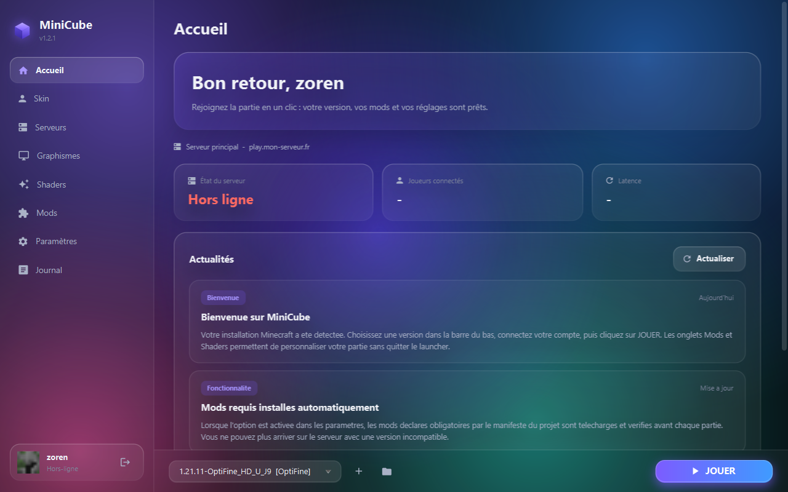
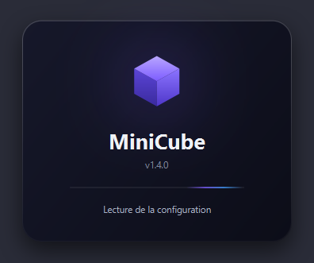
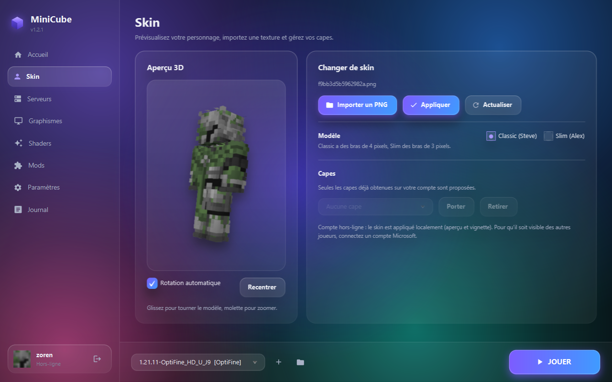
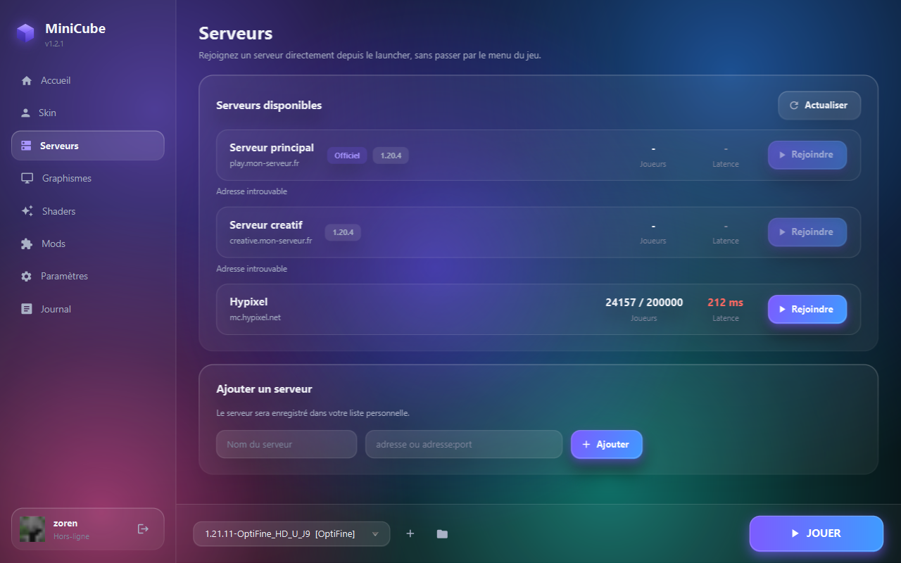
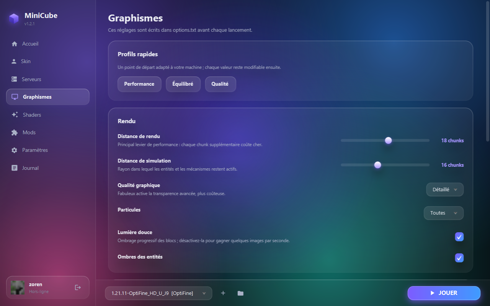
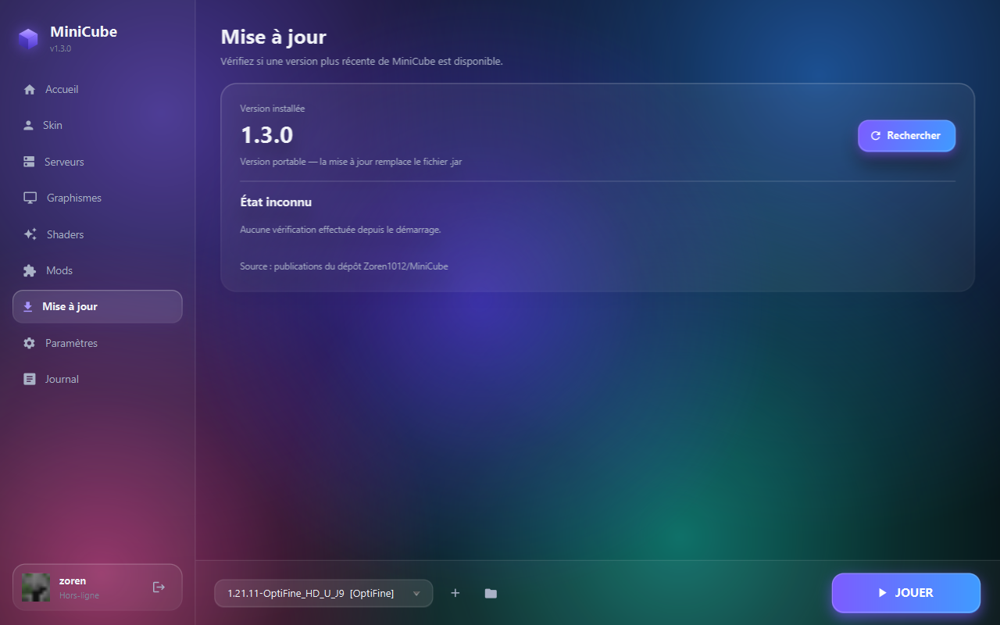

<div align="center">

# MiniCube

**Un launcher Minecraft moderne, pensé pour un serveur ou une communauté.**

Java 21 · JavaFX 21 · Windows, macOS, Linux

</div>



---

**Sommaire** — [Ce que c'est](#quest-ce-que-minicube) · [Installation](#installation) ·
[Les onglets](#les-neuf-onglets) · [Pour un serveur](#pour-un-serveur-ou-une-communauté) ·
[Publier une version](#publier-une-version) · [Limites](#limites-connues)

---

## Qu'est-ce que MiniCube ?

MiniCube remplace le launcher officiel de Minecraft quand vous voulez **maîtriser ce que
vos joueurs lancent**. Il détecte votre installation existante, télécharge ce qui manque,
et lance le jeu avec les mods et les réglages que vous avez décidés.

Concrètement, il sait :

- **lancer n'importe quelle version installée**, y compris Forge, Fabric, Quilt, NeoForge
  et OptiFine ;
- **télécharger une version** depuis le catalogue officiel, sans passer par le launcher
  de Mojang ;
- **installer Fabric, Quilt, NeoForge ou Forge** en un clic, sans aller chercher leur
  installeur ;
- **connecter un compte Microsoft** ou fonctionner en mode hors-ligne ;
- **imposer une liste de mods** à vos joueurs, vérifiée avant chaque partie ;
- **rejoindre un serveur en un clic**, avec sa latence et sa fréquentation affichées ;
- **régler les graphismes** sans ouvrir les menus du jeu.

Il n'est ni affilié ni approuvé par Mojang Studios ou Microsoft.

---

## Installation

### La plus simple — l'installeur

Téléchargez `MiniCube-Setup-<version>.exe` et double-cliquez.

**Aucun prérequis** : le runtime Java est inclus dans le paquet. L'installation se fait
dans votre dossier utilisateur (`%LOCALAPPDATA%\Programs\MiniCube`), sans demander de
droits administrateur. Vous obtenez un raccourci dans le menu Démarrer, un raccourci
bureau si vous le souhaitez, et une entrée de désinstallation classique.

### Sans installer — l'application autonome

Le dossier `dist\MiniCube\` fonctionne tel quel : lancez `MiniCube.exe`. Copiable sur une
clé USB, il n'écrit rien en dehors de votre dossier utilisateur.

### À partir des sources

Il vous faut un **JDK 21** — un JRE ne suffit pas, il n'a pas de compilateur :

```bash
winget install EclipseAdoptium.Temurin.21.JDK
```

Puis, à la racine du projet :

```bash
.\build.bat
```

```bash
.\run.bat
```

> Sous PowerShell, le préfixe `.\` est obligatoire. Les fichiers `.bat` servent de point
> d'entrée parce qu'ils échappent à la stratégie d'exécution PowerShell, contrairement
> aux `.ps1` qu'ils appellent.

Maven n'est **pas** nécessaire : le script télécharge lui-même les quatre bibliothèques
utilisées (JavaFX base, graphics, controls, et Gson) puis appelle `javac`. Un `pom.xml`
reste fourni pour ceux qui préfèrent Maven.

---

## Premier démarrage



Au lancement, MiniCube affiche les étapes réelles de son initialisation — lecture de la
configuration, vérification des dossiers, préparation de l'interface. Si l'une d'elles
prend du temps, vous savez laquelle.

Puis :

1. **Choisissez votre dossier `.minecraft`.** MiniCube propose l'emplacement standard et
   le valide. Sur Windows, c'est `%APPDATA%\.minecraft`.
2. **Connectez un compte** depuis la barre latérale, en bas à gauche.
3. **Choisissez une version** dans la barre du bas. Si la liste est vide, le bouton `+`
   ouvre le catalogue officiel.
4. **Cliquez sur JOUER.**

Vos réglages graphiques existants sont repris automatiquement depuis `options.txt` :
rien n'est écrasé sans votre accord.

---

## Comptes : ce qu'il faut savoir

MiniCube gère deux types de comptes, et la différence compte.

| | Compte Microsoft | Compte hors-ligne |
|---|---|---|
| Serveurs en ligne | Oui | Non — serveurs `online-mode=false` uniquement |
| Changement de skin visible par les autres | Oui | Non |
| Capes | Oui | Non |
| Aperçu du skin dans le launcher | Oui | Oui |
| Configuration nécessaire | Identifiant Azure, à créer une fois | Aucune |

La connexion Microsoft utilise le flux **device code** : vous saisissez un code court sur
une page Microsoft, et **aucun mot de passe ne transite par MiniCube**. Elle nécessite un
identifiant d'application Azure, gratuit et créé une seule fois — la procédure complète
est au §4 de [INSTALL.md](INSTALL.md).

Sans cet identifiant, le mode hors-ligne fonctionne immédiatement.

Plusieurs comptes peuvent cohabiter : la fenêtre de connexion les liste et permet de
basculer de l'un à l'autre.

---

## Le compte MiniCube

En plus du compte de jeu, MiniCube propose un **compte propre à votre communauté**. Il
sert à l'identité et aux statistiques d'usage, pas à jouer.

Depuis *Paramètres → Compte MiniCube*, le bouton **Ouvrir ma page de compte** lance votre
navigateur sur une page servie par MiniCube lui-même. Vous y trouvez la création du
compte, la connexion, votre profil, la déconnexion et la suppression.

| | |
|---|---|
| Pseudo | 3 à 20 caractères |
| Rôle | Membre, VIP, Modérateur, Administrateur |
| Couleur | libre, reprise sur la pastille du profil |
| Statistiques | parties lancées, temps de jeu cumulé, dernière version, cinq dernières versions jouées |

Les parties et le temps de jeu sont comptés automatiquement à chaque lancement : vous
n'avez rien à saisir.

### Deux limites, dites franchement

**Un compte MiniCube n'autorise pas à jouer sur un serveur en `online-mode=true`.** Seul
Microsoft peut le faire, et rien ne changera cela : la connexion Microsoft reste la seule
voie pour les serveurs en ligne. Le compte MiniCube vient en plus, pas à la place.

**Tant que le compte est géré sur votre machine, le rôle est déclaratif.** Vous le
choisissez vous-même : c'est une étiquette, pas une autorisation. Relié à un serveur, il
serait attribué par lui.

### Où vivent les données

Rien ne part sur Internet. La page est servie par le launcher sur `127.0.0.1`, sur un
port choisi par le système, et le compte est écrit dans `%APPDATA%\.minicube\profile.json`,
dont l'accès est restreint à votre seul compte Windows.

Le mot de passe, lui, **n'est jamais enregistré**. Seule son empreinte l'est, dérivée par
PBKDF2-HMAC-SHA256 avec 210 000 itérations et un sel tiré au hasard. Sur votre machine, ce
mot de passe ne protège rien de plus que votre session Windows — il existe pour que le
jour où vous relierez MiniCube à un vrai serveur, rien ne soit à refaire.

### Passer à un serveur distant

Les routes de la page forment un contrat qu'un serveur hébergé peut reprendre à
l'identique :

```
GET  /api/state       état : compte existant, session ouverte, profil
POST /api/register    création du compte      { username, password }
POST /api/login       ouverture de session    { username, password }
POST /api/logout      fermeture de session
POST /api/profile     mise à jour du profil   { role, color }
POST /api/delete      suppression du compte   { password }
```

Basculer d'une gestion locale à un site hébergé ne demanderait alors que de changer
l'adresse, sans toucher au reste du launcher. C'est à ce moment-là seulement que le rôle
pourrait devenir une vraie autorisation, et le compte être reconnu d'une machine à l'autre.

---

## Installer une version, vanilla ou moddée

Le bouton **+** de la barre du bas ouvre le catalogue. Choisissez un **chargeur de mods**
— Vanilla, Fabric, Quilt, NeoForge ou Forge — puis la version de Minecraft. MiniCube
propose d'office la version la plus récente du chargeur.

Vous n'avez rien d'autre à télécharger : la version vanilla dont dépend le chargeur est
installée toute seule si elle manque, et la version fraîchement posée est sélectionnée au
retour. Il ne reste qu'à cliquer sur **Jouer**.

Le catalogue affiché suit le chargeur choisi. Chacun ne couvre qu'une partie des versions
du jeu ; montrer les autres ne mènerait qu'à des échecs.

### Ce qui se passe vraiment

| | Fabric, Quilt | Forge, NeoForge |
|---|---|---|
| Méthode | un descriptif JSON est écrit | leur installeur officiel est exécuté |
| Programme téléchargé | **aucun** | l'installeur, vérifié avant d'être lancé |
| Durée | environ une seconde | une à deux minutes |

Fabric et Quilt publient leur descriptif de version : MiniCube l'écrit, et les
bibliothèques sont récupérées par le mécanisme habituel. **Rien n'est exécuté.**

Forge et NeoForge n'offrent pas cela — leur installeur est un programme. MiniCube le
télécharge depuis leur dépôt Maven officiel en HTTPS, **contrôle son empreinte SHA-1
publiée à côté de lui**, l'exécute en mode silencieux, puis l'efface. C'est le modèle de
confiance de Maven et de Gradle : il protège d'un téléchargement abîmé, non d'un dépôt
officiel qui serait lui-même compromis. Aucune autre voie n'existe pour ces deux
chargeurs, et c'est exactement ce que vous feriez à la main.

## Les neuf onglets

### Accueil

Les actualités de votre projet, l'état du serveur principal, sa fréquentation et sa
latence. Le bouton **JOUER** et le sélecteur de version restent accessibles depuis
n'importe quel onglet, dans la barre du bas.

### Skin



Aperçu 3D interactif — glissez pour tourner, molette pour zoomer. Importez un PNG
(64×64 ou 64×32), choisissez le modèle Classic ou Slim, et appliquez.

Sur un compte Microsoft, le skin est envoyé à Mojang. Sur un compte hors-ligne, il est
mémorisé localement : l'aperçu et la vignette le montrent, mais les autres joueurs ne le
verront pas — en multijoueur, le serveur demande la texture à Mojang à partir de l'UUID,
et un compte hors-ligne n'y possède aucun profil.

Les capes déjà obtenues sur votre compte sont listées et interchangeables.

### Serveurs



La latence affichée est **mesurée**, pas estimée : MiniCube implémente le protocole
*Server List Ping* et fait un véritable aller-retour avec chaque serveur. La
fréquentation et la version annoncée viennent de la même réponse.

Le bouton **Rejoindre** lance le jeu directement connecté, sans passer par le menu
multijoueur.

Vous pouvez ajouter vos propres serveurs ; ils sont conservés séparément de la liste du
projet.

### Graphismes



Distance de rendu, limite d'images par seconde, synchronisation verticale, plein écran,
particules, ombres, champ de vision. Trois profils rapides — Performance, Équilibré,
Qualité — servent de point de départ.

Ces valeurs sont écrites dans `options.txt` avant chaque lancement. Les réglages que
MiniCube ne pilote pas sont préservés tels quels.

### Shaders

Les packs présents dans `shaderpacks` sont listés avec leur aperçu, extrait du pack
lui-même. Installation depuis un fichier ou une adresse, activation en un clic.

MiniCube écrit la sélection dans la configuration d'**Iris** et d'**OptiFine** — il ne
les installe pas. Sur une version vanilla, aucun shader ne peut fonctionner.

### Mods

Les mods de votre dossier `mods` sont listés avec leur nom, version, chargeur et
description, lus directement dans les archives (`fabric.mod.json`, `META-INF/mods.toml`).

Activer ou désactiver un mod le déplace entre `mods` et `mods-disabled` : rien n'est
supprimé sans confirmation explicite.

Si votre projet publie un manifeste, les mods déclarés obligatoires sont téléchargés et
vérifiés avant chaque partie, et ne peuvent pas être désactivés.

Pour poser le chargeur lui-même, voyez [Installer une version](#installer-une-version-vanilla-ou-moddée).

### Mise à jour



MiniCube surveille les **publications de votre dépôt GitHub**. Renseignez le dépôt au
format `proprietaire/nom` dans les Paramètres, et l'onglet fait le reste : il lit la
dernière publication, choisit le fichier adapté à votre installation, affiche les
nouveautés, télécharge et installe.

Deux comportements selon la manière dont MiniCube a été installé, indiquée sous le
numéro de version :

| Installation | Fichier récupéré | Effet |
|---|---|---|
| Complète (installeur) | `MiniCube-Setup-x.y.z.exe` | L'installeur remplace l'installation |
| Portable (jar) | `MiniCube-x.y.z.jar` | Redémarrage sur le nouveau fichier |

**Une publication sans empreinte est refusée.** Ce fichier va être exécuté : MiniCube
exige un fichier `.sha256` publié à côté, et vérifie le téléchargement avant de le
lancer. Le workflow fourni génère ces empreintes automatiquement — sans elles, le
launcher refuserait ses propres mises à jour.

**L'onglet ne dit jamais « à jour » quand il n'a pas pu vérifier.** C'est une
distinction qui compte : croire qu'on possède la dernière version parce qu'un message
rassurant s'affiche, alors que la vérification a échoué, est pire que ne rien afficher.

| Ce qui s'affiche | Ce que ça veut dire |
|---|---|
| **Version x.y.z disponible** | Une version plus récente existe, avec ses nouveautés |
| **MiniCube est à jour** | Vous avez bien la dernière version publiée |
| **Aucune version publiée** | Le dépôt existe mais ne contient aucune publication |
| **Dépôt introuvable** | Le nom est erroné, ou le dépôt est privé |
| **Mise à jour refusée** | La publication existe mais n'a pas pu être vérifiée |
| **La vérification a échoué** | Réseau indisponible, ou quota GitHub atteint |

Si vous préférez héberger vos mises à jour ailleurs que sur GitHub, le champ
*adresse de mise à jour* accepte un descripteur JSON, décrit au §5 d'[INSTALL.md](INSTALL.md).

### Paramètres

Mémoire allouée, runtime Java, thème clair ou sombre, langue, image de fond,
comportement au lancement, sauvegarde distante des préférences, vérification d'intégrité,
réinitialisation.

C'est aussi d'ici que s'ouvre votre [compte MiniCube](#le-compte-minicube) : la carte
rappelle votre pseudo, votre rôle et vos statistiques, et le bouton ouvre la page dans
votre navigateur.

### Journal

Les messages de MiniCube **et la sortie complète du jeu**, en direct. C'est le premier
endroit où regarder quand quelque chose ne va pas.

Les jetons de session y sont automatiquement masqués : un journal peut être partagé sans
divulguer l'accès à votre compte.

---

## Pour un serveur ou une communauté

Cinq points d'extension permettent de piloter MiniCube **à distance**, sans redistribuer
l'application. Chacun se configure par une URL dans les paramètres ; laissée vide, la
donnée embarquée est utilisée.

| Réglage | Rôle |
|---|---|
| `newsUrl` | Vos actualités sur l'onglet Accueil |
| `serversUrl` | Votre liste de serveurs |
| `modsManifestUrl` | **Les mods obligatoires**, installés et vérifiés avant chaque partie |
| `updateUrl` | Vos mises à jour de MiniCube |
| `cloudSyncUrl` | Sauvegarde des préférences de vos joueurs |

**Exemple — imposer un pack de mods.** Publiez ce document :

```json
{
  "mods": [
    {
      "name": "Fabric API",
      "version": "0.97.0",
      "fileName": "fabric-api-0.97.0+1.20.4.jar",
      "url": "https://votre-site.fr/mods/fabric-api-0.97.0.jar",
      "sha1": "3f2a1b...",
      "required": true,
      "mcVersion": "1.20.4"
    }
  ]
}
```

Renseignez son adresse dans `modsManifestUrl`. Avant chaque partie, MiniCube télécharge
les mods manquants, remplace ceux dont l'empreinte diffère, et les rend non désactivables.
Plus personne n'arrive sur votre serveur avec une version incompatible.

Les formats attendus pour les cinq points sont détaillés au §5 d'[INSTALL.md](INSTALL.md).

### Quelques règles de sécurité à connaître

Elles peuvent surprendre, elles sont délibérées :

- Un téléchargement destiné à être **installé ou exécuté** exige une adresse `https`.
  Les adresses locales font exception, pour pouvoir développer sans certificat.
- Une **mise à jour de MiniCube** est refusée si le descripteur ne fournit pas
  d'empreinte SHA-1. Ce fichier est exécuté : le chiffrement du transport ne dit rien de
  l'intégrité du serveur d'origine.
- La sauvegarde distante ne peut **jamais** restaurer le chemin Java ni les arguments JVM.
  Rien de ce qui détermine un programme à exécuter ne vient du réseau.

Le détail figure dans [AUDIT.md](AUDIT.md).

---

## Où sont mes fichiers ?

MiniCube ne touche à votre dossier `.minecraft` que pour ce que vous lui demandez. Ses
propres données vivent ailleurs :

| Système | Emplacement |
|---|---|
| Windows | `%USERPROFILE%\.minicube\` |
| macOS, Linux | `~/.minicube/` |

```
.minicube/
├── config.json           Vos préférences
├── accounts.json         Comptes et jetons — à ne jamais partager
├── profile.json          Votre compte MiniCube : pseudo, rôle, statistiques
├── custom-servers.json   Vos serveurs ajoutés à la main
├── logs/                 Journaux, une archive par session
├── cache/                Avatars, textures, empreintes connues
├── skins/                Skins que vous avez importés
└── updates/              Paquets de mise à jour téléchargés
```

`accounts.json` contient des jetons de session. MiniCube en restreint l'accès à votre
seul compte utilisateur, mais **ne le partagez jamais** : ces jetons donnent accès à
votre compte Minecraft jusqu'à leur expiration.

Un exemple de configuration entièrement commenté est fourni :
[config.example.json](config.example.json).

Pour tout réinitialiser, fermez MiniCube et supprimez ce dossier. Votre `.minecraft`
n'est pas touché : mondes, mods et sauvegardes sont conservés.

---

## Fabriquer les livrables

```bash
.\package.bat
```

Produit dans `dist/` :

| Fichier | Quoi | Taille |
|---|---|---|
| `MiniCube\MiniCube.exe` | Application autonome, runtime Java inclus | 88 Mo |
| `MiniCube-Setup-<version>.exe` | Installeur avec raccourcis et désinstalleur | 27 Mo |

`jpackage` est fourni avec le JDK. L'installeur nécessite en plus
[Inno Setup 6](https://jrsoftware.org/isdl.php) ; s'il est absent, seul l'exécutable
autonome est produit, et le script le signale.

Le runtime embarqué est réduit à dix modules du JDK, ce qui divise sa taille par trois.

### Publier une version

```bash
.\version.bat 1.4.0
```

Le numéro de version vit dans `Constants.APP_VERSION` et dans `pom.xml`, et doit
correspondre à l'étiquette Git. Le script met les trois d'accord, compile pour vérifier
que rien n'est cassé, puis crée le commit et l'étiquette. **Il ne pousse rien** : la
commande d'envoi est affichée à la fin.

Il refuse de continuer si :

- le format n'est pas `majeur.mineur.correctif` ;
- la version **recule** — ce qui empêcherait toute mise à jour ultérieure ;
- l'étiquette existe déjà ;
- `CHANGELOG.md` ne contient pas d'entrée pour ce numéro. Ce texte est celui que vos
  joueurs liront dans l'onglet Mise à jour : autant qu'il existe.

Puis :

```bash
git push
```

```bash
git push origin v1.4.0
```

L'étiquette déclenche la fabrication sur GitHub : l'installeur, l'archive portable et
leurs empreintes sont publiés automatiquement. Quelques minutes plus tard, l'onglet
Mise à jour de vos joueurs la propose.

> **Pourquoi l'étiquette doit correspondre au code.** Le projet est compilé d'après
> `APP_VERSION` mais publié sous le nom de l'étiquette. Taguer `v1.4.0` sur un commit où
> le code dit `1.3.0` publierait un installeur 1.3.0 sous le nom 1.4.0 : vos joueurs se
> verraient proposer une mise à jour qui installe la version qu'ils ont déjà, **en
> boucle**. Le workflow refuse désormais ce cas, et `version.bat` l'empêche en amont.

Pour annuler avant d'avoir poussé :

```bash
git tag -d v1.4.0
```

```bash
git reset --soft HEAD~1
```

### Annoncer une version sur Discord

```bash
.\discord-annonce.ps1 -Webhook "https://discord.com/api/webhooks/..." -Apercu
```

Publie dans un salon une fiche d'installation : téléchargement, installation, premier
démarrage, et où regarder en cas de problème. La version et le lien sont déduits du code,
il n'y a rien à mettre à jour à la main d'une version à l'autre.

`-Apercu` montre le message sans l'envoyer ; sans ce commutateur, une confirmation est
demandée avant publication.

> **Le webhook est un secret.** Quiconque le possède peut publier dans votre salon. Il se
> passe en paramètre et n'est jamais écrit dans un fichier du projet : ne le collez nulle
> part dans le dépôt, il finirait publié sur GitHub.

Le texte de la fiche se modifie dans `discord/fiche-installation.json`, sans toucher au
script.
---

## Sous le capot

Quelques points qui vont au-delà d'une simple façade :

- **Versions moddées.** Un descripteur Fabric ou Forge ne redéfinit que ce qui change ;
  MiniCube le fusionne récursivement avec sa version parente, en concaténant
  bibliothèques et arguments dans le bon ordre.
- **Règles conditionnelles.** Les blocs `rules` des descripteurs Mojang sont évalués —
  système, architecture, version d'OS, fonctionnalités — pour ne retenir que ce qui
  s'applique.
- **Deux formats d'arguments.** Le format moderne (1.13 et suivantes) et le format
  historique sont tous deux pris en charge.
- **Connexion directe adaptée.** `--server`/`--port` jusqu'à la 1.19,
  `--quickPlayMultiplayer` à partir de la 1.20 : le format est déduit du descripteur.
- **Vérification d'intégrité mise en cache.** Contrôler 4 590 fichiers passe de 1 367 ms
  à 404 ms par lancement. Le bouton *Vérifier les fichiers* ignore volontairement ce
  cache et recalcule tout.
- **Aperçu 3D.** Chaque membre est un maillage dont les six faces sont mappées selon la
  disposition officielle des textures ; l'agrandissement est fait au plus proche voisin
  pour garder l'aspect pixelisé. Les skins 64×32, les surcouches et le modèle slim sont
  gérés.
- **Un démarrage qui ne fait pas patienter pour rien.** L'écran d'accueil montre les
  étapes réelles ; il ne reste affiché que le temps de son animation d'entrée, environ
  une seconde, et la fenêtre principale apparaît en fondu dans la continuité. La seule
  attente ajoutée est celle qui évite un clignotement.
- **Aucune ressource binaire embarquée.** Le personnage par défaut est dessiné par le
  code, les icônes sont des tracés vectoriels.

### Organisation du code

Séparation MVC stricte : les services ignorent JavaFX, les vues ignorent le réseau.

```
com.minicube.launcher
├── core/         Assemblage, constantes, chemins
├── model/        Données pures, sérialisables
├── service/      Logique métier — aucune dépendance JavaFX
├── ui/
│   ├── view/         Construction des écrans
│   ├── controller/   Liaison vues ↔ services
│   ├── component/    Fond animé, logo, aperçu 3D, notifications
│   └── dialog/       Assistant, connexion, installation de version
└── util/         Http, Json, Hashing, Zips, I18n, Log, Fx, Safety
```

La page de compte est servie depuis `src/main/resources/web/` par `ProfileWebServer` :
du HTML, du CSS et du JavaScript ordinaires, sans dépendance ni outil de construction.

---

## Limites connues

- **Les installeurs Forge et NeoForge sont exécutés tels que leur dépôt officiel les
  publie.** MiniCube vérifie leur empreinte SHA-1 avant de les lancer, mais celle-ci vient
  du même dépôt : elle protège d'un fichier corrompu, pas d'un dépôt compromis. Fabric et
  Quilt, eux, n'exécutent rien du tout.
- **Un compte hors-ligne ne peut pas avoir de skin visible** par les autres joueurs.
  C'est une limite de Minecraft, pas de MiniCube.
- **Le jeton de session transite par la ligne de commande du jeu.** Sous Linux et macOS,
  elle est lisible par les autres processus. Le launcher officiel procède de la même
  façon ; il n'existe pas d'alternative.
- La **sauvegarde distante** attend un service HTTP répondant à `GET` et `PUT` sur une
  même adresse ; aucun hébergement n'est fourni.
- **Le compte MiniCube ne donne accès à aucun serveur en ligne.** Il identifie et compte,
  il n'autorise pas : seul Microsoft peut authentifier un joueur sur un serveur en
  `online-mode=true`.
- **Le compte MiniCube ne suit pas d'une machine à l'autre.** Il est enregistré
  localement, et le rôle y est déclaratif tant qu'aucun serveur ne l'attribue.
- L'aperçu 3D montre une **pose statique** : aucune animation de marche.

---

## Documentation

| Document | Contenu |
|---|---|
| [INSTALL.md](INSTALL.md) | Installation détaillée, création de l'application Azure, formats des contenus distants, dépannage |
| [AUDIT.md](AUDIT.md) | Audit de sécurité, mesures de performance, problèmes ouverts, recommandations |
| [CHANGELOG.md](CHANGELOG.md) | Historique des versions |
| [config.example.json](config.example.json) | Configuration commentée |

---

## Licence

Projet fourni tel quel, à adapter librement à votre serveur ou à votre communauté.

Minecraft est une marque de Mojang Studios. MiniCube n'est ni affilié, ni approuvé, ni
soutenu par Mojang Studios ou Microsoft.
